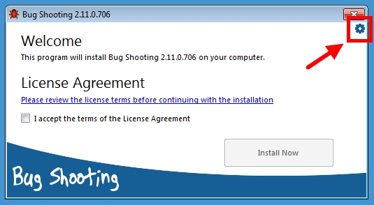
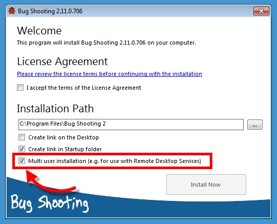

# Installation for Remote Desktop Services

You can install Bug Shooting in a multi user environment, e.g. for use with Remote Desktop Services.

> Each user in a multi user installation has his own profile for graphics history and application settings

> Each user in a multi user installation requires an unique license of Bug Shooting
 
Perform following steps to install Bug Shooting in a multi user environment.

1. Click on "Advanced Settings" button in the Setup application

2. Activate "Multi user Installation" Checkbox

